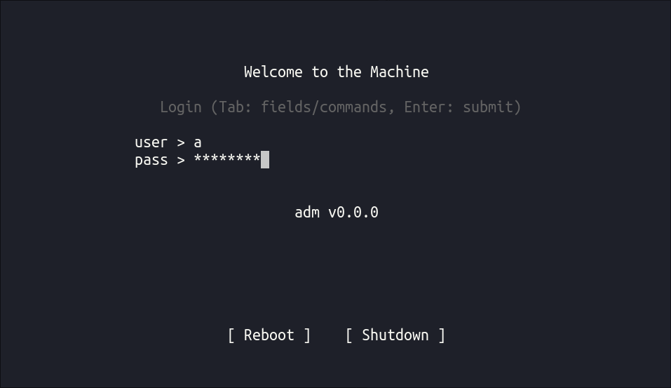
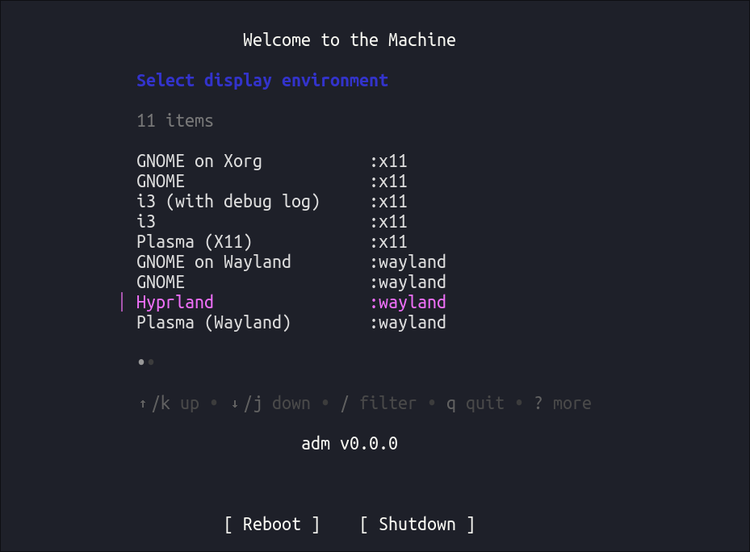

# adm

`adm` is a minimal **display manager for Linux TTY** with a **Bubble Tea**
([Charm](https://github.com/charmbracelet)) user interface. It starts
**Wayland** or **X11** sessions from standard `.desktop` entries.

The code inspired and based on exellent [Emptty display
manager](https://github.com/tvrzna/emptty) that also written in Go. Really I
started the code with fork of Emptty with adding Bubble Tea TUI and changing
some features.





## Features

- Wayland and X11 carriers; configurable X server binary via **`XORG_BIN`** (e.g. Xlibre).
- Login and session selection in a TUI (username/password, optional `:commands`, session list).
- PAM authentication (service name **`adm`**).
- Configuration under **`/etc/adm/`**; user files **`~/.config/adm`** or **`~/.adm`** (see emptty-compatible semantics).

## Build

```sh
make build   # binary: dist/adm
```

Build tags (same idea as emptty):

- **`nopam`** — build without PAM (testing / restricted libc).

```sh
make build TAGS=nopam
```

## Install (outline)

```sh
make install install-config install-pam install-systemd
```

Enable `adm.service` and configure **`/etc/pam.d/adm`**. Migrate from emptty by replacing paths **`/etc/emptty`** → **`/etc/adm`**, **`emptty`** → **`adm`**, and user config **`~/.config/emptty`** → **`~/.config/adm`**.

## License

Copyright (C) 2026 contributors.

This program is free software: you can redistribute it and/or modify it under the terms of the **GNU General Public License v3** as published by the Free Software Foundation. See [LICENSE](LICENSE).

Portions derived from **emptty** are used under the MIT License; see [THIRD_PARTY_NOTICES.md](THIRD_PARTY_NOTICES.md) and [LICENSES/MIT-emptty.txt](LICENSES/MIT-emptty.txt).
